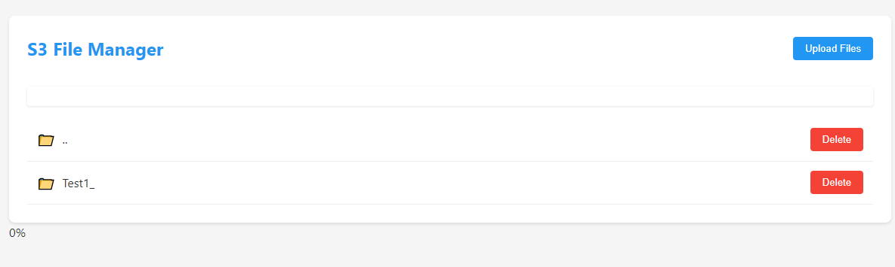

# S3 File Manager

## Project Description

S3 File Manager is a lightweight, web-based file management system for Amazon S3 buckets. This project provides a simple and intuitive interface for users to interact with their S3 storage, allowing them to browse, upload, download, and delete files and folders seamlessly.

Key features:
- Browse S3 bucket contents with a folder-like structure
- Upload files to specific paths within the S3 bucket
- Download files from the S3 bucket
- Delete files and folders (including recursive deletion for folders)
- Clean and responsive web interface
- Secure configuration using environment variables

This project is designed to be easily integrated into other applications or used as a standalone tool for S3 bucket management.




## Open Usage Declaration

S3 File Manager is open for use and integration into any project that requires file archiving, storage management, or S3 interaction capabilities. Feel free to modify, extend, or incorporate this project into your own work, whether for personal, educational, or commercial purposes.

## Steps to Use This Project

1. **Setup**:
   - Clone the repository to your local machine.
   - Ensure you have Python 3.7+ installed.

2. **Install Dependencies**:
   ```
   pip install -r requirements.txt
   ```

3. **Configure Environment Variables**:
   - Create a `.env` file in the root directory of the project.
   - Add the following variables to the `.env` file:
     ```
     AWS_ACCESS_KEY=your_aws_access_key
     AWS_SECRET_KEY=your_aws_secret_key
     AWS_REGION=your_aws_region
     S3_BUCKET=your_s3_bucket_name
     ```
   - Replace the values with your actual AWS credentials and S3 bucket name.

4. **Run the Application**:
   ```
   python app.py
   ```

5. **Access the Web Interface**:
   - Open a web browser and navigate to `http://localhost:5000`
   - You should see the S3 File Manager interface.

6. **Using the Interface**:
   - Browse: Navigate through your S3 bucket structure using the folder-like interface.
   - Upload: Use the upload button to add files to your current location in the S3 bucket.
   - Download: Click on file names to download them.
   - Delete: Use the delete button next to files or folders to remove them from the S3 bucket.

7. **Integration**:
   - To integrate this project into your own application, you can:
     - Use the Flask app as a blueprint in a larger Flask application.
     - Adapt the routes and functions to fit your existing backend structure.
     - Utilize the frontend code and modify it to match your application's design.

## Notes for Deployment

- Ensure proper security measures are in place when deploying to a production environment.
- Use HTTPS for all communications in a production setting.
- Implement user authentication if the application will be accessible publicly.
- Regularly update dependencies to ensure you have the latest security patches.
- In a production environment, consider using a more robust method for managing secrets, such as AWS Secrets Manager or environment variables set through your deployment platform.

## Security Best Practices

- Never commit your `.env` file to version control. Add `.env` to your `.gitignore` file.
- Regularly rotate your AWS access keys.
- Use IAM roles and policies to limit the permissions of your AWS credentials to only what's necessary for this application.
- Consider using AWS's temporary credentials or IAM role-based authentication for enhanced security in production environments.

## Contributing

Contributions to improve S3 File Manager are welcome! Feel free to fork the repository, make your changes, and submit a pull request.
